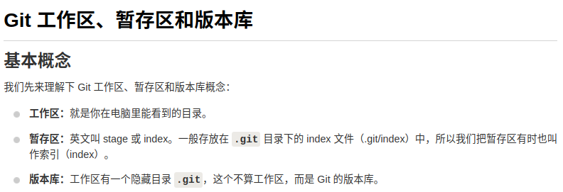
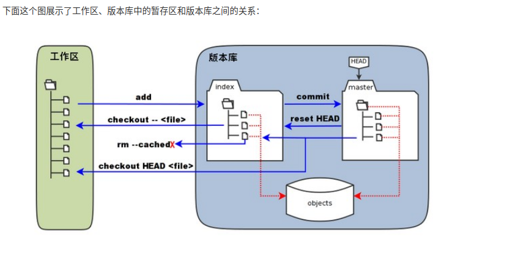
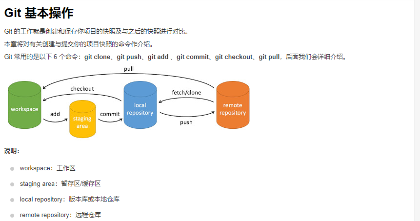
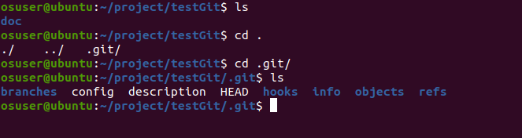

# Git使用教程

## 1.安装

​		使用库安装：

sudo apt update

sudo apt-get install git

​		测试：git --version

## 2.git三区基本概念以及工作流程

### 概念：

### 工作流程

## 3.git常用命令

​	1）git项目创建

​		新建testGit目录，执行：git init

​		执行后，会创建一个.git 文件夹 

​		

2)add

